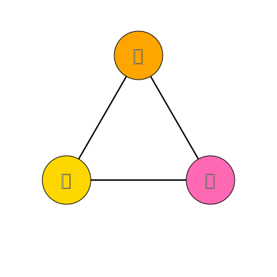
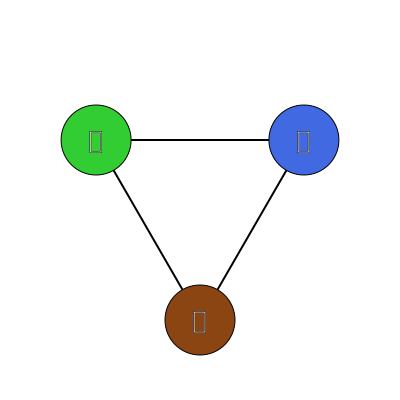
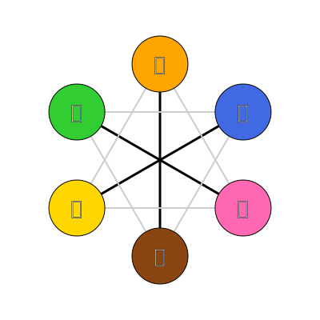

# このドキュメントは何？

記憶力勝負に思えるナインタイルにおいて、記憶だけに頼らない攻略法を解説するもの。

* 短期記憶も結果的には重要。
* ただし、「なんとなく記憶する」のと、「攻略法を知り、体系的に記憶する」のでは、後者の方が上達が格段に速い。
* 攻略法を身につけるための練習サイト/アプリも作成しました。
* 是非、手元にナインタイル実物を用意して手を動かしながら確認してみてください。

# ナインタイル解説初級編

## 模様のグループ分け

ナインタイルには6種類の柄がありますが、これを2つのグループに分けます。

### 1. 暖色グループ

ドーナツ、クッキー、桜
※模様が複数に分かれていないグループ、と覚えても良い

### 2. 寒色グループ

ブロック、花火、キウイ

※模様が複数に分かれているグループ、と覚えても良い

## タイルの分類（3種類）

上記のグループ分けを踏まえると、9枚のタイルは以下の3種類に分類できることがわかります。

### A: 純暖色タイル

表も裏も暖色グループの柄。単に「暖色タイル」とも呼ぶ。

* -
* -
* -

### B: 純寒色タイル

表も裏も寒色グループの柄。単に「寒色タイル」とも呼ぶ。

* -
* -
* -

### X: クロスエッジタイル

表と裏で、暖色と寒色が入れ替わるタイル。別名、色系統横断タイル。

* -
* -
* -

## 何が嬉しい？

**「どのタイルを裏返せばいいか分からない！」という迷いがなくなります。**
複雑な絵合わせを、単純な「数の調整」だけで解けるようになるからです。

### 基本の手順

1.  お題を見て、暖色・寒色の数を数える。
2.  **クロスエッジタイル（X）**を使って、その「数の差」を作る。
    * クロスエッジタイルの寒暖枚数差が、全体の寒暖枚数差と一致するように置きます。
3.  あとは**残りの6マス**を、同系色タイル（A、B）で埋めるだけです。

## 具体例による解説

例題つきで一つひとつ説明します。

### 例題①

* このお題は、暖色：5枚、寒色：4枚です。▶暖色が寒色より1枚多いです。
* クロスエッジタイルも、暖色が寒色より1枚多くなるように配置します。※写真の置き方は例です。他にもこの条件を満たす置き方があり、それでも問題なく解けます。

* すると、残りの6マスは、純暖色を3枚、純寒色を3枚置けるようになっています
* あとは、純暖色・純寒色タイルをそれぞれの同系色の中で配置・反転させるだけです。
    * 純暖色タイルは次

    * 純寒色タイルは次

### 例題②

* このお題は、暖色：3枚、寒色：6枚です。▶暖色が寒色より3枚少ないです。
* クロスエッジタイルも、暖色が寒色より3枚少なくなるように配置します。
  * ポイント：クロスエッジタイルは全部で3枚しかありません。つまり、3枚すべてを裏返して「寒色」にすればいいです。

* すると、残りの6マスは、純暖色を3枚、純寒色を3枚置けるようになっています
* あとは、純暖色・純寒色をそれぞれの同系色の中で配置・反転させるだけです。
    * 純暖色タイルは次

    * 純寒色タイルは次

## まとめ

本初級編でお伝えした攻略法の核心は、ナインタイルを**「9枚の絵合わせ」から「3枚の数合わせ」という単純なゲームに変換すること**です。

* **視点の転換**
    6種類の絵柄を個別に探すのではなく、「暖色・寒色」という2つの属性だけで捉えます。
* **攻略のカギ**
    盤面の難易度を支配しているのは、たった3枚の**「クロスエッジタイル」**です。残りの6枚（純暖色・純寒色）は、実はただの数合わせに過ぎません。
* **攻略手順**
    1.  お題の「暖色・寒色の枚数」を数える。
    2.  その枚数差になるように「クロスエッジタイル（3枚）」を先に配置する。
    3.  残りのスペースを同系色の純色タイルで埋める。

# コラム：「クロスエッジタイル」の命名 〜ナインタイルとグラフ理論〜

「クロスエッジタイル」。この名前、なんとなくカッコイイのではなく、グラフ理論に基づいた命名になっています。

### ナインタイルのグラフ構造

ナインタイルをグラフ理論的に見ると、以下のように対応します。

- **ノード（点）：** 模様
- **エッジ（線）：** タイル

ナインタイルはグラフ理論に基づいて詳細に解析が可能で、師匠のOB沼尾氏が詳細に実施しています。今回紹介する内容は基礎です。

### 1. 暖色間遷移

- **橙・桃・黄**の3つの模様（色）を行き来する**辺（エッジ）が「純暖色タイル」に対応します。**

### 2. 寒色間遷移

- **青・緑・茶**の3つの模様（色）を行き来する**辺（エッジ）が「純寒色タイル」に対応します。**

### 3. 色系統横断遷移（クロスエッジ）

- 「暖色間遷移」のグループと「寒色間遷移」のグループ。**この2つのグループを結んで横断する太線が、「クロスエッジタイル」に対応します。**
- 2つのグループを**クロス（交差・横断）**する**エッジ（辺）**だから、**「クロスエッジタイル」**です。

# 攻略法の練習Tips

執筆中

* クロスエッジタイルだけを手に取ってプレイしてみる
  * クロスエッジタイルは斜め45度で置く
* 沼尾氏・大野木の作成した練習サイトの活用

# おまけ

Xで全く同じ攻略法を語っている人を発見。

https://x.com/wand125/status/1041342686865702914/photo/1
